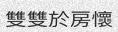
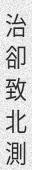

# Tutorial

TextRecognitionDataGenerator comes with an (hopefully) easy to use CLI. The tutorial
is actually multiple tutorials, combined in a single page. Feel free to skip sections
that are not relevant to your use case.

## Just generating data

Fun fact, you don't need to use any command line arguments if you want English data
generated using multiple fonts. Indeed, simply running `python3 run.py` will create
1000 English, single word images in the `out/` directory such as these:

Now maybe 1000 is too many or too few for your usecase. You can add the `-c` argument
to set how many examples will be generated.

`python3 run.py -c 10`

As expected, you will find 10 examples in the `out/` directory.

## Generating Chinese data

This is a common usecase, and one that is easy with TRDG.

`python3 run.py -c 10 -l cn`

This will generate 10 samples using the Chinese dictionary that can be found in
in `dicts/cn.txt`:

Since the concept of word in Chinese is a bit trickier, the dictionary is made of single
characters (make your own!). Let's do this again with `-w 5` to get something prettier.

`python3 run.py -c 10 -l cn -w 5`

Now that looks better, but what's up with the spacing between the characters? We would rather
have no spaces. Add `-sw 0`.

`python3 run.py -c 10 -l cn -w 5 -sw 0`

Asian scripts can be written top to bottom, you might want to
add the `-or 1` argument to get vertical text.

`python3 run.py -c 10 -l cn -w 5 -sw 0 -or 1`

You can do much and more with TRDG, if you run into a missing feature, simply [open an issue](https://github.com/Belval/TextRecognitionDataGenerator/issues/new).

## Text distorsions

For those familiar with the process of training a machine learning model, you often have to deal with overfitting, which is
when the model gets too good at predicting the samples in the training data and stops generalizing to unseen examples. One trick
to prevent this is by adding the distorsion to the data.

While TRDG does not dwelve too deeply in augmentations, as many better and more complete [libraries](https://github.com/search?q=image+augmentation)
already take care of it, some operations are available for convenience through the `-d` argument which as 3 possible values:

- 0: None
- 1: Sine wave
- 2: Cosine wave
- 3: Random

`python3 run.py -c 5 -w 5 -d 1`

`python3 run.py -c 5 -w 5 -d 3`

## A more advanced use case

Text in the real world is not always black, and most importantly, text in the real
world is almost never straight. What if we want to emulate that?

`python3 run.py -c 10 -k 15 -rk -bl 0.5 -rbl -tc '#000000,#888888'`

Which can be translated to: generate 10 examples with a skewing angle between -15 and
15 with an added gaussian blur between 0 and 0.1. Finally, the text color should be picked randomly
between black and gray (including all the colors inbetween).

Sure enough, the output is much more colourful!

The default resolution might be too small to your taste (and I agree). By default the output is 32 pixels high
because it's the height used by most text recognition papers. Now you can change that with `-f 64`.

`python3 run.py -c 10 -k 15 -rk -bl 0.5 -rbl -tc '#000000,#888888' -f 64`

